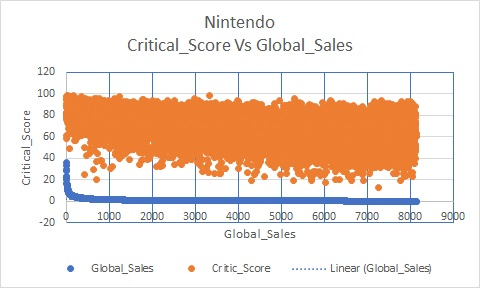
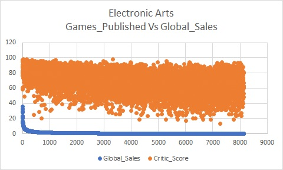
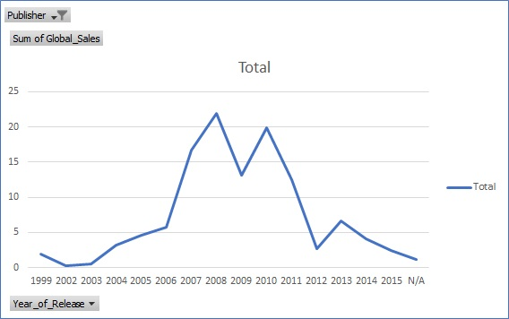
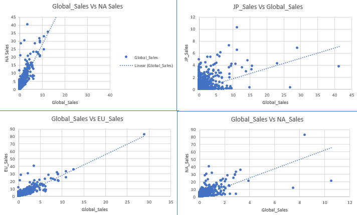

# Game-Sales-Analysis
Excel Master

# Background

Looking into a product's sales within a region and comparing it to that product's sales worldwide is a great way to determine how important a region is to a company. In this activity, you will pair up with one of your classmates in order to create a series of scatter plots which will compare video game sales across regions.

Now that we know how to apply filters to a spreadsheet and create charts based on filtered data sets, we'll take some time to create charts which compare the sales of publishers against one another.

# Goals 

1. Create a scatter plot which graphs the critical response (Critic Score) of games published by Nintendo as compared to their global sales.

2. Create a scatter plot which graphs the critical response of games published by Electronic Arts as compared to their global sales.

3. Select all of the data on the worksheet and create a line chart which can be filtered by publisher, whose rows are set by a game's year of release, and whose values are the sum of global sales for that year.

# Findings

#

#

#

